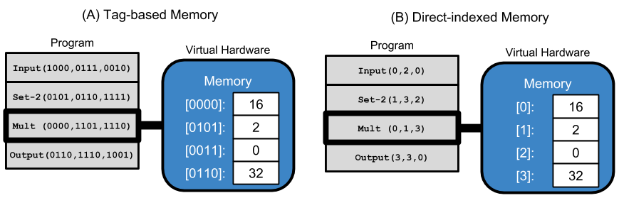

# Tag-accessed Memory for Genetic Programming

**Navigation**

<!-- TOC -->

- [Project Overview](#project-overview)
  - [Tag-accessed Memory](#tag-accessed-memory)
- [References](#references)

<!-- /TOC -->

## Project Overview

This project explores the efficacy of tag-accessed memory.

### Tag-accessed Memory

Tags are evolvable labels that give genetic programs a flexible mechanism for specification.
Tag-based naming schemes have been demonstrated for labeling and referencing program
modules (Spector, 2011; Lalejini and Ofria, 2018).

We continue to expand the use of tags in GP by incorporating tag-based referencing
into the memory model of a simple linear GP representation.
In this study, memory comprises 16 statically tagged memory registers, and instructions
use tag-based referencing to refer to positions in memory.
Programs our simple representation are linear sequences of instructions, and each
instruction has three tag-based arguments, which may modify the instruction's
behavior. Below, we provide a visual example, contrasting traditional direct-indexed
memory access and tag-based memory access.

In the example above, both programs have identical behavior: requesting input,
setting the second register to the terminal value '2', multiplying the input by
2, and outputting the result.

## References

Lalejini, A., & Ofria, C. (2018). Evolving event-driven programs with SignalGP. In Proceedings of the Genetic and Evolutionary Computation Conference on - GECCO ’18 (pp. 1135–1142). New York, New York, USA: ACM Press. https://doi.org/10.1145/3205455.3205523

R Core Team (2016). R: A language and environment for statistical computing. R Foundation for
Statistical Computing, Vienna, Austria. URL https://www.R-project.org/.

Spector, L., Martin, B., Harrington, K., & Helmuth, T. (2011). Tag-based modules in genetic programming. In Proceedings of the 13th annual conference on Genetic and evolutionary computation - GECCO ’11 (p. 1419). New York, New York, USA: ACM Press. https://doi.org/10.1145/2001576.2001767